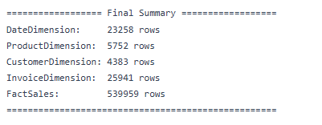

# Project ETL Data Retail Online
Tugas ini kami buat untuk melakukan simulasi etl(Extract, Transform, Load) untuk membangun sebuah warehouse, dengan menggunakan data set tentang transaksi perusahaan retail daring tanpa toko di uk

Link Dataset : [Dataset Online Retail]("https://www.kaggle.com/datasets/tunguz/online-retail")
 
Sumber : Kaggle 

## Summary Data
### Jumlah data

### Top 10 Countries By revenue

### Top 10 Customer by Invoice Count

### Top 10 Product Qunatity Sales

### Top 10 Product By revenue

### Unit price VS Quantity Sold

### Monthly Total Revenue

